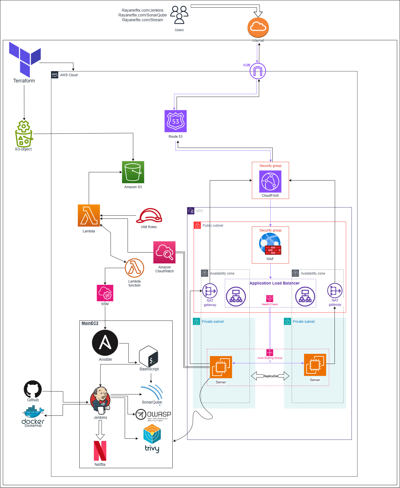
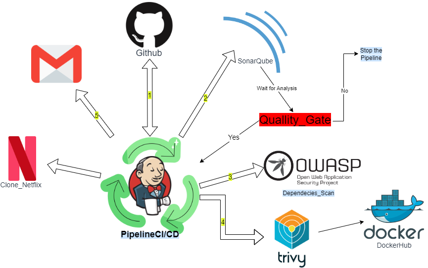
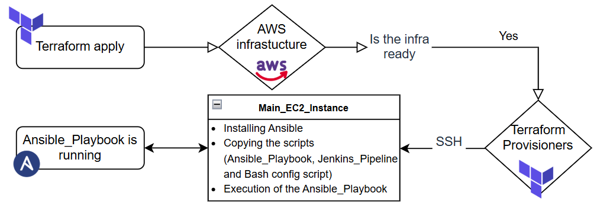
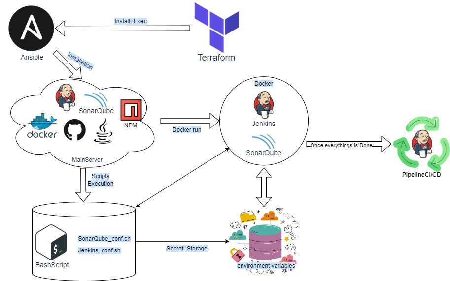

# AWS-DevSecOps-Architecture
RayaneFlix is a fully automated, secure, and highly available cloud infrastructure project designed to host a Netflix-like streaming web application on AWS.   This project follows DevSecOps principles, integrating security, automation, high availability, and cost optimization throughout the entire deployment lifecycle.


The architecture uses Infrastructure as Code (IaC) with Terraform and Ansible, a complete CI/CD pipeline with Jenkins and SonarQube, and includes dynamic security analysis with SAST, DAST, and dependency scanning tools.


<div align="center">
  
  <p align="center">Home Page</p>
</div>


## 🌟 Project Objectives

- Deploy a **highly available**, **resilient**, and **secure** streaming website infrastructure on AWS.
- **Automate** infrastructure creation and server configuration using **Terraform** and **Ansible**.
- **Integrate security** early in the development lifecycle using DevSecOps practices (SAST/DAST analysis).
- **Optimize costs** through dynamic resource provisioning and efficient cloud design.
- Achieve **zero manual intervention** deployment with fully automated pipelines.

---

## 🛠️ Main Features

- **Infrastructure as Code** using Terraform for AWS resource creation.
- **Automated server configuration** (Ansible) to install and configure Jenkins, SonarQube, Docker, Trivy, npm.
- **CI/CD pipeline** with Jenkins integrating:
  - Source code analysis (SonarQube)
  - Dependency vulnerability scanning (OWASP Dependency Check)
  - Container image security scanning (Trivy)
  - Docker image building and deployment
- **Reverse Proxy and CDN** with AWS CloudFront.
- **Web Application Firewall (WAF)** with ModSecurity EC2 instance.
- **Secure access** to EC2 instances using AWS Systems Manager (no SSH exposure).
- **ALB Load Balancing** for traffic distribution across multi-AZ instances.
- **Lambda Functions** for automating post-deployment scripts and configuration.
- **Automated security reports** emailed after each pipeline execution.

---

## 🏗️ Architecture Overview

### Part 1: Initial Architecture Part 1

<div align="center">
  
</div>

In the first phase of the project, a basic AWS infrastructure was deployed to host the streaming web application.  
It was designed as a simple, quick-to-deploy environment **focusing on automation and CI/CD setup**.

**Main Components:**
- A **Virtual Private Cloud (VPC)** with a **public subnet**.
- A single **EC2 instance** publicly accessible over the Internet.
- An **Internet Gateway (IGW)** attached to the VPC.
- A **Security Group** controlling access to the EC2 instance (SSH, HTTP, Jenkins, SonarQube, Streaming service ports).
- **Terraform** used to provision the entire infrastructure.
- **Ansible** used to configure the EC2 instance automatically (installing Jenkins, SonarQube, Docker, npm).
- **Jenkins** managing the CI/CD pipeline, integrating SonarQube, Trivy, and Dependency-Check for security analysis.

This initial setup allowed:
- **Rapid deployment** of a prototype.
- **Early security testing** through integrated code analysis.
- **Hands-on automation practice** (IaC + Configuration Management).
- Preparing for the **next phase** with a more secure and scalable cloud design.

---

### Part 2: Final Secure and Scalable Architecture

<div align="center">
  
</div>

The second phase evolved into a production-grade, fully automated, and secured AWS architecture following DevSecOps principles.

**Main Components:**
- **VPC** with **multi-AZ deployment**:
  - 1 Public Subnet (for NAT Gateway and WAF EC2 instance)
  - 2 Private Subnets (for application EC2 instances across different AZs)

- **Routing Setup**:
  - **Inbound traffic**:
    ```
    Internet → Route 53 (DNS) → CloudFront (CDN + Reverse Proxy) → ModSecurity WAF (EC2) → ALB (Application Load Balancer) → Private EC2 instances
    ```
  - **Outbound traffic**:
    ```
    Private EC2 → NAT Gateway → Internet
    ```

- **Security Enhancements**:
  - **ModSecurity WAF** (on EC2) to filter incoming traffic before reaching the application.
  - **Application Load Balancer (ALB)** with path-based routing for Jenkins, SonarQube, and the Streaming App.
  - **IAM roles** with Least Privilege Principle.
  - **AWS Systems Manager (SSM)** for secure access without public IP or SSH.

- **Automation:**
  - **Terraform** to fully provision infrastructure.
  - **AWS Lambda functions** triggered after resource creation to automate setup (copy scripts from S3, install Ansible, run playbooks).
  - **Ansible playbooks** to install Jenkins, SonarQube, Docker, npm, and configure services.

- **CI/CD Pipeline:**
  - **SonarQube** for static code analysis (SAST).
  - **OWASP Dependency-Check** for dependency vulnerabilities.
  - **Trivy** for container and system scanning (DAST).
  - **Automated email notifications** after each CI/CD execution with build logs and security reports.
 <div align="center">
  
</div>

- **High Availability and Scalability:**
  - Multi-AZ setup for fault tolerance.
  - Health checks via ALB to redirect traffic away from unhealthy instances.
  - Future readiness for Auto Scaling integration.

This final architecture ensures **maximum security**, **resilience**, **scalability**, and **full automation**, making it a production-ready solution aligned with modern DevSecOps best practices.


---

## 🚀 Quick Start Guide

### Prerequisites

- AWS Account with admin permissions
- Python3.9+ is required.
- Terraform installed (`>= v1.0.0`) [installed and in your $PATH](https://learn.hashicorp.com/terraform/getting-started/install.html).
- AWS CLI installed and configured [installed and in your $PATH](https://docs.aws.amazon.com/cli/latest/userguide/cli-chap-install.html), and an AWS account with sufficient privileges to create and destroy resources.
- [jq](https://stedolan.github.io/jq/)
- Git installed
- SSH Key Pair in your AWS account
- TMDB (The Movie Database) API Key & an E-mail App Password for Email Notifications ( **Full explanation is bellow** )
  

Linux
```bash
sudo apt install terraform awscli azure-cli jq -y
```

Mac
```bash
brew install terraform awscli azure-cli jq
```


### Installation

1. **Clone the repository:**

```bash
git clone https://github.com/Rayanekdr/AWS-DevSecOps-Architecture.git
cd AWS-DevSecOps-Architecture
```
2. **Configure for AWS & tell which AWS profile to use in Terraform Config**

```bash
  aws configure --profile CLI_Kali
```

---


## ⚙️ Additional Setup Requirements

Before running the full project, a few manual configurations are necessary to ensure correct functioning of the CI/CD pipeline, email notifications, and the streaming app.

**Follow these steps carefully:** 


### 1️⃣ Create a TMDB (The Movie Database) API Key

This API key is required to fetch movie data for the RayaneFlix streaming application.

- Go to [TMDB Website](https://www.themoviedb.org/).
- Log in or create a free account.
- Go to **Profile → Settings → API**.
- Click **Create** and accept the terms and conditions.
- Provide the required information and generate your **API key**.
- **Save your TMDB API key** for the next steps.


### 2️⃣ Create a Gmail App Password (for Email Notifications)

> Gmail will be used to send automated email notifications after pipeline execution.

Follow these steps to generate an App Password:

- Log in to your Gmail account.
- Go to **Manage your Google Account** → **Security** tab.
- Under **Signing in to Google**, click **App passwords**.
- You may need to verify your identity.
- Select:
  - **App:** Mail
  - **Device:** Choose your device or select "Other".
- Click **Generate** and save the **App Password** (looks like a 16-digit code).

> This password will be used in the next steps.


### 3️⃣ Modify the Pipeline Configuration

Update the pipeline file to insert your TMDB API Key and Email Address.

1. Open the file:
   ```bash
   nano AWS-DevSecOps-Architecture/Terraform-Projet-Part1/RayaneFlix-pipeline.groovy
   ```
   - **Line 64**: Add your TMDB API key inside the Docker build command.
   ```bash
   sh "docker build --build-arg TMDB_V3_API_KEY=<your-key> -t rayaneflix ."
   ```
   - **Line 89**: Add your email address where you want to receive pipeline reports.

### 4️⃣ Configure Jenkins Credentials for DockerHub Access


1. Open the Jenkins configuration script:
   ```bash
   nano AWS-DevSecOps-Architecture/Terraform-Projet-Part1/jenkins_conf.sh
   ```
   - **Line 211**: Add your DockerHub username and DockerHub password in the credentials block
     ```
     'DOCKERHUB-Name',
     'YourDocker-Hub-Password'
     ```
> This allows Jenkins to build and push Docker images to your DockerHub repository automatically during the pipeline execution.


### 5️⃣ Configure Jenkins Email Notification

> Still inside the same file jenkins_conf.sh:

  - **Line 234**: Add your Gmail email address for notifications
    ```bash
    mailer.setSmtpHost("smtp.gmail.com")
    mailer.setDefaultSuffix("your-email@gmail.com")
    mailer.setSmtpAuth("your-email@gmail.com", "${EMAIL_PASSWORD}")
    mailer.setUseSsl(true)
    mailer.setSmtpPort("465")
    mailer.save()
    ```
> Confirm again at Line 345 and Line 346 that your email is correctly set for all notification configurations.
> This setup ensures Jenkins can send you build status and security analysis reports after each pipeline run.


### 6️⃣ Create emailP.txt for Gmail App Password Storage

Create a text file to securely store your Gmail App Password:
    ```
    nano AWS-DevSecOps-Architecture/Terraform-Projet-Part1/emailP.txt
    ```


### 7️⃣ Create EC2 SSH Key Pair (RayaneSSH)

Before deploying the infrastructure, you must create an SSH Key Pair to allow Terraform to connect to the EC2 instances during provisioning.

1. Go to your AWS Console → EC2 → Key Pairs.

2. Create a new Key Pair:
   - **Name:** RayaneSSH
   - **Type:** RSA
   - **Format:** `.pem` (for Linux/macOS/WSL)
  
    
3. Download the private key file (`RayaneSSH.pem`) and place it in **Terraform-Projet-Part1** 
   ```
   cd AWS-DevSecOps-Architecture/Terraform-Projet-Part1
   ```

4. Ensure the file permissions are correct:

   ```
   chmod 400 RayaneSSH.pem
   ```


### 8️⃣ Deploy the Infrastructure with Terraform


```bash
cd AWS-DevSecOps-Architecture/Terraform-Projet-Part1
terraform init
terraform apply -auto-approve
```


>  ***No manual configuration is required; everything is fully automated post-deployment***

---

## 🌐 Access Your Services

Once the deployment is complete, you can access the following services if you are in the **Terraform-Project-Part2**:

- **Jenkins:** [https://yourdomain.com/jenkins](https://yourdomain.com/jenkins)
- **SonarQube:** [https://yourdomain.com/sonarqube](https://yourdomain.com/sonarqube)
- **Streaming App:** [https://yourdomain.com/streaming](https://yourdomain.com/streaming)

> 🔔 Replace `yourdomain.com` with the domain you configured in **Route 53** inside your Terraform scripts.

For the **Terraform-Project-Part1**:

- **Jenkins:** [http://localhost:8080](http://localhost:8080)
- **SonarQube:** [http://localhost:9000](http://localhost:9000)
- **Streaming App:** [http://localhost:8081](http://localhost:8081)

---


## 📈 Deployment Workflow Diagram

<div align="center">
  
</div>


## 🤖 Automation Architecture Overview with Ansible and Bash Scripts

<div align="center">
  
</div>


---
## 🛠️ Technologies Used

- **AWS Services:** EC2, VPC, S3, IAM, CloudFront, Route 53, ALB, Lambda, Systems Manager (SSM)
- **Automation Tools:** Terraform, Ansible
- **CI/CD Tools:** Jenkins, SonarQube
- **Security Tools:** OWASP Dependency-Check, Trivy, ModSecurity WAF
- **Scripting:** Bash

---

## 🛡️ Security Focus (DevSecOps)

- **Static Application Security Testing (SAST):** SonarQube.
- **Dynamic Application Security Testing (DAST):** Trivy for container and system vulnerability scanning.
- **Dependency Vulnerability Scanning:** OWASP Dependency-Check.
- **IAM and Access Management:** Policies respect the principle of Least Privilege.
- **No public SSH:** EC2 instances are accessible only via **AWS Systems Manager (SSM) in the second part of the project**.

---


## 🤝 Contribution

Pull requests are welcome!  
For major changes, please open an issue first to discuss what you would like to change.

---

## 📩 Contact

Project made by **Rayane Khadraoui**.

For any questions or collaborations, feel free to contact me at:  
📧 [rayane.khadraoui@utt.fr](mailto:rayane.khadraoui@utt.fr)

---
