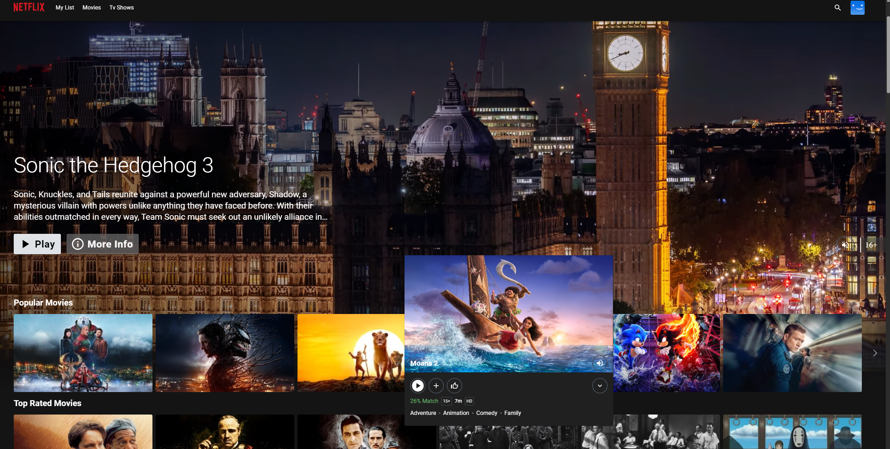
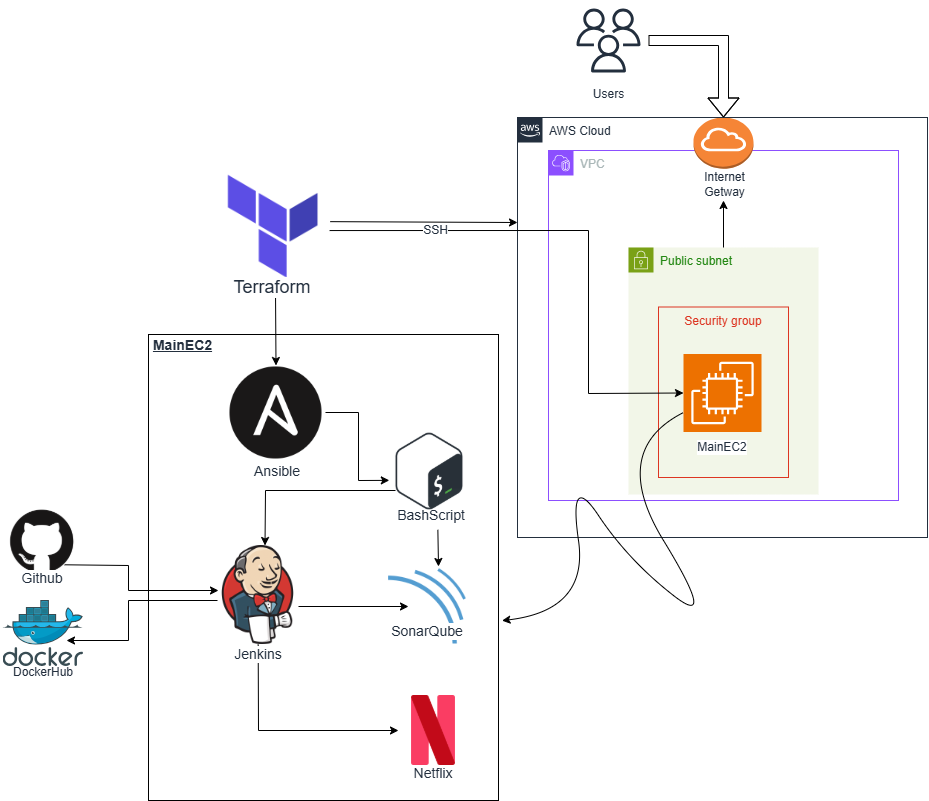

# AWS-DevSecOps-Architecture
RayaneFlix is a fully automated, secure, and highly available cloud infrastructure project designed to host a Netflix-like streaming web application on AWS.   This project follows DevSecOps principles, integrating security, automation, high availability, and cost optimization throughout the entire deployment lifecycle.


The architecture uses Infrastructure as Code (IaC) with Terraform and Ansible, a complete CI/CD pipeline with Jenkins and SonarQube, and includes dynamic security analysis with SAST, DAST, and dependency scanning tools.


<div align="center">
  
  <p align="center">Home Page</p>
</div>
---

## 🌟 Project Objectives

- Deploy a **highly available**, **resilient**, and **secure** streaming website infrastructure on AWS.
- **Automate** infrastructure creation and server configuration using **Terraform** and **Ansible**.
- **Integrate security** early in the development lifecycle using DevSecOps practices (SAST/DAST analysis).
- **Optimize costs** through dynamic resource provisioning and efficient cloud design.
- Achieve **zero manual intervention** deployment with fully automated pipelines.

---

## 🛠️ Main Features

- **Infrastructure as Code** using Terraform for AWS resource creation.
- **Automated server configuration** (Ansible) to install and configure Jenkins, SonarQube, Docker, Trivy, npm.
- **CI/CD pipeline** with Jenkins integrating:
  - Source code analysis (SonarQube)
  - Dependency vulnerability scanning (OWASP Dependency Check)
  - Container image security scanning (Trivy)
  - Docker image building and deployment
- **Reverse Proxy and CDN** with AWS CloudFront.
- **Web Application Firewall (WAF)** with ModSecurity EC2 instance.
- **Secure access** to EC2 instances using AWS Systems Manager (no SSH exposure).
- **ALB Load Balancing** for traffic distribution across multi-AZ instances.
- **Lambda Functions** for automating post-deployment scripts and configuration.
- **Automated security reports** emailed after each pipeline execution.

---

## 🏗️ Architecture Overview

### Part 1: Initial Architecture Part 1

<div align="center">
  
</div>

In the first phase of the project, a basic AWS infrastructure was deployed to host the streaming web application.  
It was designed as a simple, quick-to-deploy environment **focusing on automation and CI/CD setup**.

**Main Components:**
- A **Virtual Private Cloud (VPC)** with a **public subnet**.
- A single **EC2 instance** publicly accessible over the Internet.
- An **Internet Gateway (IGW)** attached to the VPC.
- A **Security Group** controlling access to the EC2 instance (SSH, HTTP, Jenkins, SonarQube, Streaming service ports).
- **Terraform** used to provision the entire infrastructure.
- **Ansible** used to configure the EC2 instance automatically (installing Jenkins, SonarQube, Docker, npm).
- **Jenkins** managing the CI/CD pipeline, integrating SonarQube, Trivy, and Dependency-Check for security analysis.

This initial setup allowed:
- **Rapid deployment** of a prototype.
- **Early security testing** through integrated code analysis.
- **Hands-on automation practice** (IaC + Configuration Management).
- Preparing for the **next phase** with a more secure and scalable cloud design.

---

### Part 2: Final Secure and Scalable Architecture

<div align="center">
  
</div>

The second phase evolved into a production-grade, fully automated, and secured AWS architecture following DevSecOps principles.

**Main Components:**
- **VPC** with **multi-AZ deployment**:
  - 1 Public Subnet (for NAT Gateway and WAF EC2 instance)
  - 2 Private Subnets (for application EC2 instances across different AZs)

- **Routing Setup**:
  - **Inbound traffic**:
    ```
    Internet → Route 53 (DNS) → CloudFront (CDN + Reverse Proxy) → ModSecurity WAF (EC2) → ALB (Application Load Balancer) → Private EC2 instances
    ```
  - **Outbound traffic**:
    ```
    Private EC2 → NAT Gateway → Internet
    ```

- **Security Enhancements**:
  - **ModSecurity WAF** (on EC2) to filter incoming traffic before reaching the application.
  - **Application Load Balancer (ALB)** with path-based routing for Jenkins, SonarQube, and the Streaming App.
  - **IAM roles** with Least Privilege Principle.
  - **AWS Systems Manager (SSM)** for secure access without public IP or SSH.

- **Automation:**
  - **Terraform** to fully provision infrastructure.
  - **AWS Lambda functions** triggered after resource creation to automate setup (copy scripts from S3, install Ansible, run playbooks).
  - **Ansible playbooks** to install Jenkins, SonarQube, Docker, npm, and configure services.

- **CI/CD Pipeline:**
  - **SonarQube** for static code analysis (SAST).
  - **OWASP Dependency-Check** for dependency vulnerabilities.
  - **Trivy** for container and system scanning (DAST).
  - **Automated email notifications** after each CI/CD execution with build logs and security reports.

- **High Availability and Scalability:**
  - Multi-AZ setup for fault tolerance.
  - Health checks via ALB to redirect traffic away from unhealthy instances.
  - Future readiness for Auto Scaling integration.

This final architecture ensures **maximum security**, **resilience**, **scalability**, and **full automation**, making it a production-ready solution aligned with modern DevSecOps best practices.


